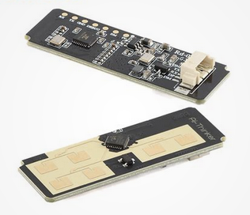

# RD03D Arduino Library

A simple **Arduino library** for interfacing with the **Ai-Thinker RD03D** 24GHz mmWave radar module via UART.



## Features
✅ Easy-to-use interface for configuring and reading radar data.  
✅ Supports both **single** and **multi-target** detection modes.  
✅ Works with **Arduino-compatible board** that has a separate hardware UART.  


## Compatibility

✅ **Tested on:** ESP32 (ESP32-WROOM-32, ESP32-S3)  
❌ **Not tested on:** AVR (Arduino Uno), SAMD (Arduino Zero), RP2040 (Raspberry Pi Pico)

To ensure compatibility, the library uses hardware Serial1 to interface the radar module.


## Getting Started

### 1️⃣ Installation
Clone this repository or download the ZIP file and place it in your Arduino `libraries/` folder.

### 2️⃣ Usage Example
Upload the following **example sketch** to your Arduino:

```cpp
#include <RD03D.h>

#define RX_PIN 26
#define TX_PIN 27

RD03D radar(RX_PIN, TX_PIN);

void setup() {
    Serial.begin(115200);
  	radar.initialize(); 
}

void loop() {
	static TargetData*  ptrTarget = radar.getTarget();    // get pointer to first target ( SINGLE DETECTION )
  static uint64_t     next_screen_update = 0;

  // Call the task method frequently to check for new frames.
  radar.tasks();

  // Plot information, We display data a bit less oftern
  if ( millis() > next_screen_update){

    next_screen_update = millis() + 1000;   // Update next tick every second

    // Check if Target is detected, then display the values.
    if(ptrTarget->isValid())
      ptrTarget->printInfo();   // Display target information over serial
  }
  
  delay(10); // Some delay
}
```

